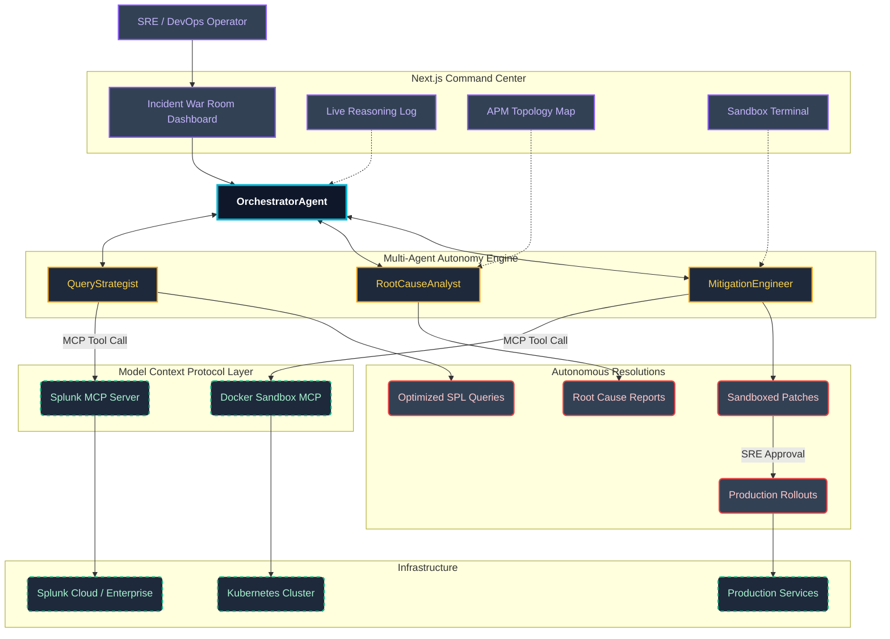

# AegisMCP — Architecture Diagram

## System Architecture

## Data Flow

1. **Incident Detection** → Active alerts are ingested from Splunk into the War Room Dashboard.
2. **Query Synthesis** → The `QueryStrategist` translates natural language into optimized SPL via the Splunk MCP Server.
3. **Root Cause Isolation** → The `RootCauseAnalyst` correlates log patterns and APM traces to pinpoint the fault.
4. **Sandboxed Remediation** → The `MitigationEngineer` compiles a patch and dry-runs it in an isolated Docker sandbox via MCP.
5. **Production Rollout** → After SRE approval, the validated fix is deployed to the production Kubernetes cluster.

## Agent Communication

| Agent | MCP Tool | Input | Output |
|-------|----------|-------|--------|
| QueryStrategist | `splunk_search` | Natural language + schema | Optimized SPL query |
| RootCauseAnalyst | `splunk_results` | Raw log data + APM traces | Fault isolation report |
| MitigationEngineer | `docker_sandbox` | Root cause + code context | Validated remediation patch |
| Orchestrator | All tools | Agent telemetry | Coordinated pipeline state |
